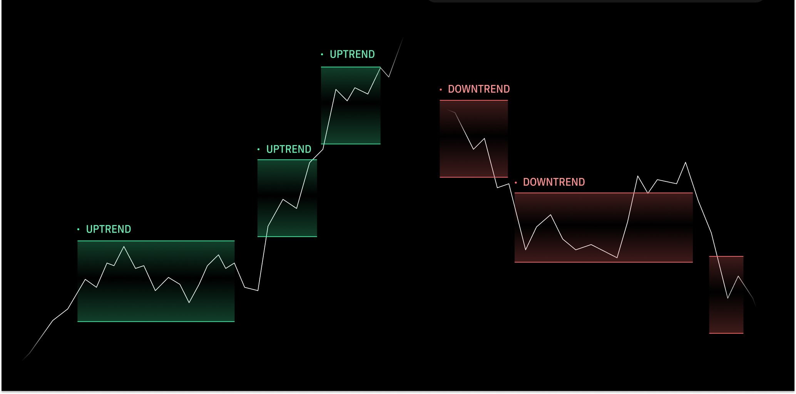

# Reversion Strategy for Haiko AMM

The Reversion Strategy operates on a trend classification model (`Up`, `Down` or `Ranging`) to place countervailing liquidity positions in the Haiko AMM, capturing fees on reversion to the trend.



## How it works

Positions automatically follow the price of an asset, updated on either single or double-sided price action, depending on the prevailing trend. It is inspired by [Maverick Protocol](https://www.mav.xyz/)'s Left and Right modes and enables liquidity provision in both volatile and stable market conditions.

Unlike the first [Replicating Strategy](https://haiko-docs.gitbook.io/docs/protocol/strategy-vaults/live-vaults/replicating-strategy) for Haiko, it:

1. Does not rely on an external oracle price, allowing for use with a much wider range of pairs.
2. Tracks Vault positions with ERC20 tokens, allowing for greater composability across DeFi protocols.
3. Builds on top of [Giza](https://www.gizatech.xyz/)'s zkML stack and trustless Agents to bring the outputs of a trend classification model on-chain.
4. Will be built in open source

## Getting started

```shell
# Run the tests
snforge test

# Build contracts
scarb build
```

## Version control

- [Scarb](https://github.com/software-mansion/scarb) 2.6.3
- [Cairo](https://github.com/starkware-libs/cairo) 2.6.3
- [Starknet Foundry](https://github.com/foundry-rs/starknet-foundry) 0.21.0
- [OpenZeppelin Contracts](https://github.com/OpenZeppelin/cairo-contracts/) 0.11.0
